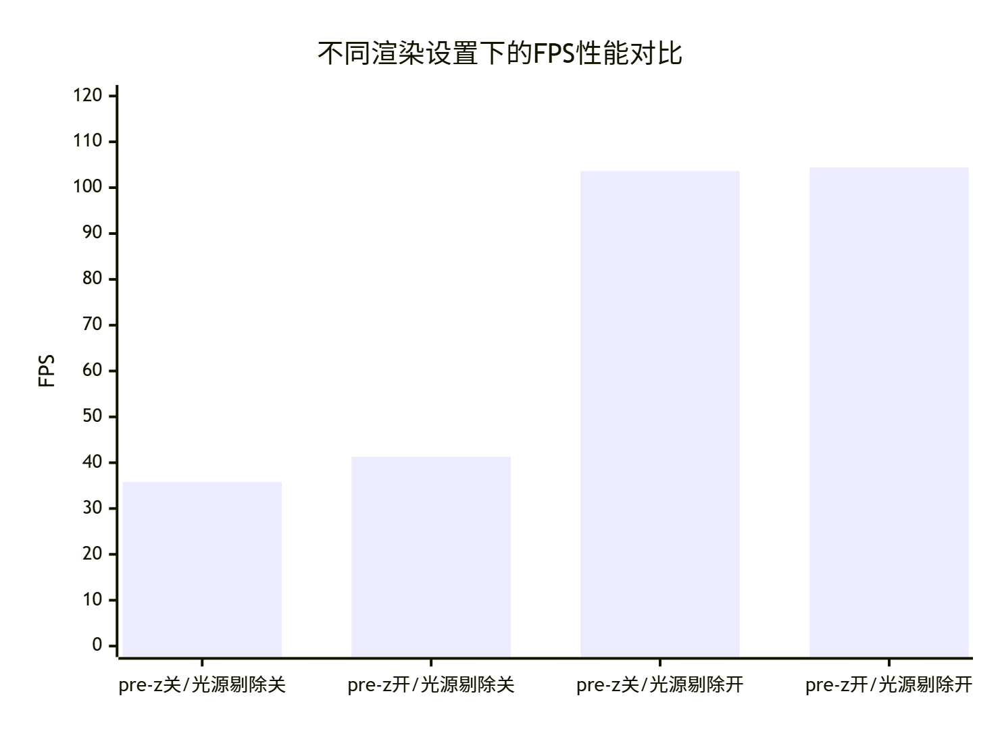
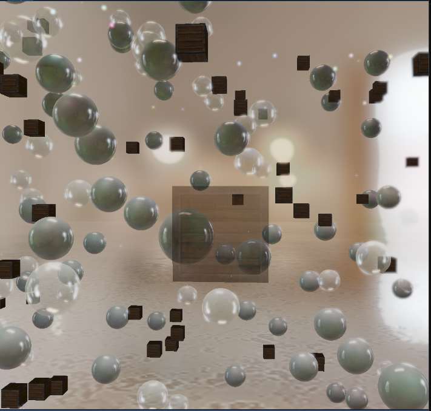

## Forward+

#### 基本概念

使用tile_based Forward+管线，在屏幕空间划分tile，计算影响每块tile对应的视锥区域的可见光源，极大降低了片段着色器负担。并结合pre-z解决了overdraw问题。在1000+动态光源和1000+实例的较复杂场景有不错的帧率表现。

#### 效果展示

显卡(RTX 2060s)，视口大小(1800×1410)，总实例数目1000，总动态光源数目1500，帧率约为180+左右


##### 性能对比

均以下比较场景：

2000+**不透明物体实例**，1000+**半透明物体实例**，1500+静态光源；视口大小1018×1014；显卡RTX2060s；摄像机位置和朝向固定

| 前6s平均FPS | 关闭光源剔除 | 开启光源剔除 |
| ----------- | ------------ | ------------ |
| 关闭pre-z   | 35.81        | 103.61       |
| 开启pre-z   | 41.26        | 104.44       |



##### 展示

开启光源剔除：


关闭光源剔除：

##### 

从上图发现，关闭光源剔除后，总体更亮，说明目前的光源剔除算法有误，多剔除了光源。


#### 为什么使用Forward+

Forward管线计算复杂度同时受到光源数目、场景复杂度的影响。

有以下两个瓶颈：

1.overdraw严重。当场景中有大量物体需要分别提交渲染命令，先绘制的物体可能被后绘制的物体遮挡，导致出现大量无效绘制。

>补充说明early -z的局限性。硬件early-z 能根据深度缓冲记录的深度，在片段着色器前剔除被遮挡的片段。但early-z只能剔除一次渲染绘制命令提交的被遮挡片段，无法处理跨渲染命令的全局遮挡关系。并且early -z的效果和本次渲染绘制的顺序有关，如果是从后到前绘制，则无法有效剔除。为了有效发挥early -z的效果，避免overdraw，关键需要提前在深度缓冲中记录全局的深度，即使用下文中的 pre-z。

2.无效的光源计算。片段着色器会遍历场景中所有光源计算光照，当光源数目非常大时，片段着色器会成为瓶颈。实际上光源如果离该片段所在表面位置较远，影响可忽略不计。


Forward+针对这两个问题做出改进：

1.使用pre-z pass，在着色之前记录全局深度，保证每个像素光照阶段只调用一次片段着色器，避免overdraw。

2.将屏幕划分为多个tile，基于每个tile形成的视锥体进行光源剔除，tile中的像素只使用可见的光源计算光照。


对比延迟渲染：

* 和延迟管线一样，每个像素只调用一次片段着色器，这点打平
* 无需使用极占显存的gbuffer，也因此物体材质更灵活性，同时还能支持MSAA
* 能方便地支持透明物体渲染

>延迟渲染也需要进行光源剔除，才能应对存在大量光源的场景
>
>Unity SRP 实战（四）Cluster Based Lighting - AKG4e3的文章 - 知乎
>https://zhuanlan.zhihu.com/p/464099000


#### 实现步骤

##### pre-z

在着色之前，绘制场景中所有**不透明物体**，关闭颜色纹理附件写入且片段着色器为空，仅写入深度。


##### 光源剔除

使用计算着色器完成。将屏幕划分为16×16的tile，每个tile形成一个视锥体（frustum），其近平面深度是tile内像素的最小深度，远平面深度是tile内像素的最大深度。用该视锥体进行光源剔除。由于光源可视为球体（半径为其最大衰减距离），可分别用frustum的6个面和球体求交，判断球体是否在frustum内部。

每个tile使用visible_lights的一块区域（SSBO/结构化缓冲区）记录可见光源的索引，最多记录N（设为1024）个可见光源，因此在此实现中，场景光源上限也只能为N。


```c++
void Engine::Pre_Z_Pass::CullLights()
{
	MainCamera* camera = MainCamera::GetInstance();
	glm::mat4 viewMatrix = camera->GetViewMatrix();
	glm::mat4 projMatrix = camera->GetProjectionMatrix();
	glm::mat4 viewProjMatrix = projMatrix * viewMatrix;
	debug_texture->Clear();
	RenderCommand::InsertBarrier(BarrierDomain::RenderTargetWriteToSample);
	auto depthtexture = FBO->GetDepth();
	auto tile_depth_shader = m_pipeline_settings.ShaderManager->Get("culling_lights").get();
	tile_depth_shader->Bind();
    
    //debug texture用于记录tile的深度计算结果
	depthtexture->Bind(0);
	ImageBindDesc desc;
	desc.binding = 1;
	desc.access = TextureAccess::WriteOnly;
	debug_texture->BindAsImage(desc);

	//绑定场景光源SSBO数据，同时绑定可见光索引。
	m_pipeline_settings.lights_gpu->Bind(0);
	visible_lights->Bind(1);

	tile_depth_shader->SetFloat("max_visible_distance", 100.f);
	tile_depth_shader->SetMat4("view", viewMatrix);
	tile_depth_shader->SetMat4("projection", projMatrix);
	glm::mat4 inv_VP = glm::inverse(viewProjMatrix);
	tile_depth_shader->SetMat4("viewProjection", viewProjMatrix);
	tile_depth_shader->SetMat4("inv_VP_matrix", inv_VP);
	tile_depth_shader->SetInt("points_light_count", 1000);
	tile_depth_shader->SetInt("spot_light_count", 100);

	//16×16的tile
	RenderCommand::Dispatch(std::ceil(debug_texture->GetWidth() / 16.0f), std::ceil(debug_texture->GetHeight() / 16.0f), 1);
}
```

计算着色器细节

1.计算tile的frustum各面（世界坐标）

* 采样深度贴图，并转线性深度
* **原子操作**比较tile内各像素的深度，得到最大和最小深度

```glsl
    float depth = texelFetch(u_depth, sampleCoord,0).r;
    //min_z和max_z是共享内存，原子操作比较大小和写入  
    //计算线性深度  
    //使用线性深度后，不再出现tile之间剔除结果差异巨大的问题
    //距离远的光源自动被剔除，无法理解
    //转为线性深度
    depth = (0.5 * projection[3][2]) / (depth + 0.5 * projection[2][2] - 0.5);

    //记录最小和最大原始深度
    uint depthInt = floatBitsToUint(depth);
	atomicMin(minDepthInt, depthInt);
	atomicMax(maxDepthInt, depthInt);
    barrier();
   
   //计算tile的frustum顶点
    if(gl_LocalInvocationIndex==0){
        min_z=uintBitsToFloat(minDepthInt);
        max_z=uintBitsToFloat(maxDepthInt);
        vec2 tileID= vec2(gl_WorkGroupID);
        vec2 tileNum=vec2(gl_NumWorkGroups);


        tile_frustum[0]=vec3(tileID/tileNum,min_z);  
        tile_frustum[1]=vec3((tileID+vec2(1.0,0.0))/tileNum,min_z);
        tile_frustum[2]=vec3((tileID+vec2(0.0,1.0))/tileNum,min_z);
        tile_frustum[3]=vec3((tileID+vec2(1.0,1.0))/tileNum,min_z);
        tile_frustum[4]=vec3(tileID/tileNum,max_z);
        tile_frustum[5]=vec3((tileID+vec2(1.0,0.0))/tileNum,max_z);
        tile_frustum[6]=vec3((tileID+vec2(0.0,1.0))/tileNum,max_z);
        tile_frustum[7]=vec3((tileID+vec2(1.0,1.0))/tileNum,max_z);

		//ndc空间中的视锥面
        tile_frustum_plane[0]=vec4(0.0,0.0,-1.0,0.0);
        tile_frustum_plane[1]=vec4(-1.0,0.0,0.0,0.0);
        tile_frustum_plane[2]=vec4(0.0,1.0,0.0,0.0);
        tile_frustum_plane[3]=vec4(1.0,0.0,0.0,0.0);
        tile_frustum_plane[4]=vec4(0.0,-1.0,0.0,0.0);
        tile_frustum_plane[5]=vec4(0.0,0.0,1.0,0.0);

        //利用tile_frustum[0]和tile_frustum[7]两个相对的角点，分别为三个视锥面的交会点。计算视锥面的第四个参数
        tile_frustum_plane[0].w=-dot(tile_frustum_plane[0].xyz,tile_frustum[0]);
        tile_frustum_plane[1].w=-dot(tile_frustum_plane[1].xyz,tile_frustum[0]);
        tile_frustum_plane[2].w=-dot(tile_frustum_plane[2].xyz,tile_frustum[0]);
        tile_frustum_plane[3].w=-dot(tile_frustum_plane[3].xyz,tile_frustum[7]);
        tile_frustum_plane[4].w=-dot(tile_frustum_plane[4].xyz,tile_frustum[7]);
        tile_frustum_plane[5].w=-dot(tile_frustum_plane[5].xyz,tile_frustum[7]);

        //使用逆转置矩阵变换？？？，正确
        mat4 T=inverse(inv_VP_matrix);
        T=transpose(T);
        for(int i=0;i<6;i++){

            tile_frustum_plane[i]=T*tile_frustum_plane[i];
            float invLen = inversesqrt(dot(tile_frustum_plane[i].xyz, tile_frustum_plane[i].xyz));
            tile_frustum_plane[i] *= invLen;
        }
        //从屏幕空间到世界空间
        for(int i=0;i<8;i++){
            vec3 ndc=2*tile_frustum[i]-vec3(1.0);
            vec4 world=inv_VP_matrix*vec4(ndc,1.0);
            tile_frustum[i]=world.xyz/world.w;
        }

```

>平面方程使用vec4表示，xyz是法线，w是位置参数。已知平面上一点P0，带入方程得到w


2.使用frustum进行光源剔除

*  面 F(vec4) 和顶点P (vec4)相乘，结果为0，则顶点在面上，大于0，在正面；小于0在背面。
* 如果顶点在正面且和一个面的距离大于光源半径，则说明在frustum之外。

```
bool cullPointsLight2(vec3 position,float falloff_end){ 
    for(int i=0;i<6;i++){
        if(dot(tile_frustum_plane[i],vec4(position,1.0f))>falloff_end)   
        return false;     
    }
    return true;
}
```


##### 绘制

TODO


#### 局限性

TODO

