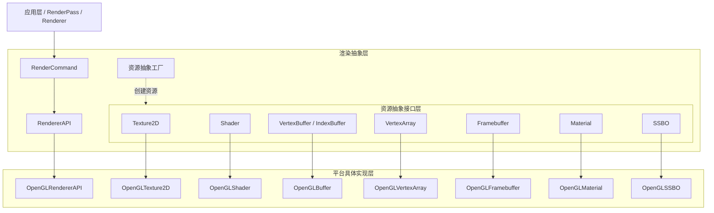
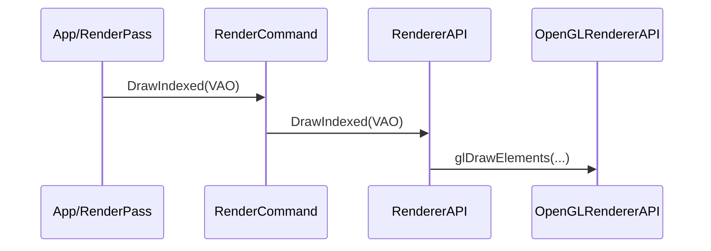

# 跨图形 API 抽象设计文档

## 一、设计目标

- 通过统一抽象层屏蔽不同图形 API（OpenGL、Vulkan、DirectX）的差异。
- 以最小接口集覆盖渲染和计算所需的核心功能。
- 提供一致的资源生命周期管理方式（创建、使用、销毁）。
- 使应用层代码不依赖底层 API，实现后端可替换性。
- 保持接口风格简洁清晰，避免过度工程化。


## 二、整体架构

整体架构分为三层：

1. **应用层（App / RenderPass / Renderer）**：渲染逻辑与引擎系统。
2. **抽象层（RendererAPI + 抽象资源类）**：统一接口，屏蔽平台差异。
3. **平台实现层（OpenGL、Vulkan、DX）**：具体渲染 API 的实现。

### 架构图




## 三、资源抽象设计

每类 GPU 资源遵循统一的抽象模式：

1. 资源基类定义所有平台共享的接口。
2. 资源工厂根据当前 API（OpenGL/Vulkan/DX）创建实际实现。
3. 平台具体类封装对底层渲染 API 的访问。

### 资源创建流程示意

```cpp
Ref<Texture2D> Texture2D::Create(w, h, format) {
    switch (Renderer::GetAPI()) {
        case RendererAPI::OpenGL:
            return CreateRef<OpenGLTexture2D>(w, h, format);
    }
}
```


## 四、资源模块

### 1. Texture2D

#### 抽象接口

```cpp
class Texture2D {
public:
    virtual void Bind(uint32_t slot) const = 0;
    virtual void BindAsImage(const ImageBindDesc&) const = 0;
    virtual void SetData(const void* data, size_t size) = 0;
    virtual uint32_t GetRendererID() const = 0;
};
```

#### OpenGL 实现

```cpp
void OpenGLTexture2D::BindAsImage(const ImageBindDesc& desc) const {
    glBindImageTexture(
        desc.binding,
        m_RendererID,
        desc.mipLevel,
        desc.layered ? GL_TRUE : GL_FALSE,
        desc.layer,
        AccessToGL(desc.access),
        m_InternalFormat
    );
}
```

#### 设计说明

- 资源接口对齐 OpenGL 使用模式（通过bind直接绑定资源对象），便于快速开发。
- 访问方式简单，适合 Compute 场景。
- 未来可加入 TextureDesc，使其更易映射 Vulkan/DX。


### 2. Framebuffer

#### 抽象接口

```cpp
class Framebuffer {
public:
    virtual void Bind() = 0;
    virtual void Resize(uint32_t width, uint32_t height) = 0;
    virtual Ref<Texture2D> GetColorAttachment() = 0;
    ...
};
```

#### OpenGL 实现要点

```cpp
glCreateFramebuffers(1, &m_FBO);
glFramebufferTexture2D(
    GL_FRAMEBUFFER,
    GL_COLOR_ATTACHMENT0,
    GL_TEXTURE_2D,
    colorTex->GetRendererID(),
    0
);
```

#### 设计说明

- Framebuffer 创建和管理作为纹理附件的Texture，resize时Framebuffer重新创建纹理附件。
- 当前版本 Framebuffer 与 Texture 耦合度较高，可在未来版本中解耦，由外部传入附件纹理。


### 3. Buffers 与 VertexArray

#### Vertex/Index Buffer 接口

```cpp
class VertexBuffer {
public:
    virtual void Bind() const = 0;
    virtual void SetData(const void* data, uint32_t size) = 0;
    virtual const BufferLayout& GetLayout() const = 0;
	virtual void SetLayout(const BufferLayout& layout) = 0;
    ...
};
```

#### 设计说明

* 通过BufferLayout成员指明顶点数据布局
* SetData上传cpu数据到显存

#### VertexArray

抽象所有顶点输入状态：

```cpp
class VertexArray {
public:
    virtual void Bind() const = 0;
    virtual void AddVertexBuffer(const Ref<VertexBuffer>&) = 0;
    virtual void SetIndexBuffer(const Ref<IndexBuffer>&) = 0;
    ...
};
```

#### 设计说明

- VertexArray 在 OpenGL 中对应 VAO，封装了Vertex和Indices。

  


### 4. Shader

#### 抽象接口

```cpp
class Shader {
public:
    virtual void Bind() const = 0;
    virtual void SetInt(const std::string&, int) = 0;
    virtual void SetFloat(const std::string&, float) = 0;
    virtual void SetMat4(const std::string&, const glm::mat4&) = 0;
};
```

#### OpenGL 构造流程

```cpp
std::string source = ReadFile(filepath);
auto shaderSources = PreProcess(source);
Compile(shaderSources);
```

#### 设计说明

- 封装 Shader 编译、链接、Uniform 上传。
- 当前依赖 glUniform，未来转向 UBO 或 DescriptorSet 模式。


### 5. Material

材质统一管理 Shader 与 Texture 资源。

```cpp
class Material {
public:
    virtual void Bind() const = 0;
    virtual void SetTexture(const std::string& name, Ref<Texture2D>, int slot) = 0;
    virtual void SetFloat(const std::string& name, float value) = 0;
};
```

#### 设计说明

- 通过统一绑定接口提高可维护性。
- 有利于渲染合批与状态减少。
- 当前版本依赖 Shader 的 uniform 模型，可在未来移向更现代的绑定模型。


### 6. SSBO（ShaderStorageBuffer）

```cpp
class ShaderStorageBuffer {
public:
    virtual void Bind(uint32_t binding) const = 0;
    virtual void SetData(const void* data, uint32_t size, uint32_t offset = 0) = 0;
};
```

用于 Forward+、计算着色器、大规模实例数据等场景。


## 五、渲染命令抽象

渲染命令采用“静态入口 + 抽象接口 + 平台实现”三层结构：



------

### RenderCommand

```cpp
RenderCommand::SetBlendState(BlendDesc::AlphaBlend());
RenderCommand::Clear(clearDesc);
RenderCommand::DrawIndexed(vertexArray);
RenderCommand::Dispatch(8, 8, 1);
RenderCommand::InsertBarrier(ComputeWriteToGraphicsRead);
```

### RendererAPI（抽象接口）

```cpp
class RendererAPI {
public:
    virtual void SetViewport(uint32_t x, uint32_t y, uint32_t w, uint32_t h) = 0;
    virtual void Clear(const ClearDesc&) = 0;
    virtual void DrawIndexed(Ref<VertexArray>) = 0;
    virtual void Dispatch(uint32_t x, uint32_t y, uint32_t z) = 0;
    virtual void InsertBarrier(BarrierDomain) = 0;
};
```

### OpenGLRendererAPI（平台实现）

包含 glDrawElements、glDispatchCompute、glMemoryBarrier 等调用。

------

## 六、状态描述符

### BlendDesc

用于配置混合模式：

```cpp
 // 完整的混合状态描述
 struct BlendDesc
 {
 bool alphaToCoverageEnable = false; // Alpha-to-Coverage
 bool independentBlendEnable = false; // 每个RT独立混合设置

 // 多个渲染目标的混合设置（通常支持8个）
 static constexpr int MAX_RENDER_TARGETS =8;
 RenderTargetBlendDesc renderTarget[MAX_RENDER_TARGETS];

 // 混合常量颜色（用于ConstantColor混合因子）
 float blendFactor[4] = {0.0f,0.0f,0.0f,0.0f };
 }

```

### DepthStencilDesc

用于配置深度与模板测试：

```cpp
struct DepthStencilDesc {
	bool depthTestEnable = true;
	bool depthWriteEnable = true;
	CompareOp depthCompare = CompareOp::Less;
    ...
};
```

### ClearDesc

```cpp
struct ClearDesc {
    glm::vec4 Color = glm::vec4(0.0f, 0.0f, 0.0f, 1.0f);
    float Depth = 1.0f;
    int Stencil = 0;
    ...
}
```


## 七、OpenGL 后端实现要点

- 使用 OpenGL DSA（Direct State Access）接口减少状态绑定：

```cpp
glCreateTextures(GL_TEXTURE_2D, 1, &m_RendererID);
glTextureStorage2D(m_RendererID, mipLevels, internalFormat, width, height);
glBindTextureUnit(slot, m_RendererID);
```

- 资源对象均由 RAII 控制生命周期。
- 所有渲染命令均通过 RendererAPI 调度。


## 八、不足与未来改进方向

1. 抽象层仍包含 VAO、SSBO 等 OpenGL 特有概念，可进一步抽象为更通用的 InputLayout、StorageBuffer。
2. ShaderUniform 模型依赖 glUniform，没有对齐现代图形 API 的 DescriptorSet / UBO 模式。
3. Framebuffer 与 Texture 耦合，可以改为“外部提供附件”的方式构建 Framebuffer。
4. Pipeline State（渲染管线状态）尚未抽象，可在未来版本统一为独立对象，减少状态切换复杂度。

